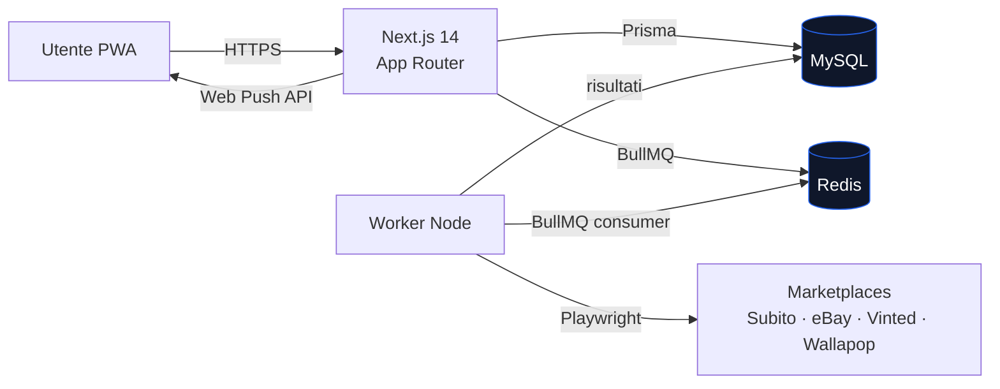

<div align="center">

<!--
  ┌─────────────────────────────────────────────────────────────────┐
  │ PLACEHOLDER — LOGO                                              │
  │                                                                 │
  │ Prompt per generazione immagine:                                │
  │ "Minimal flat logo for a marketplace deal-hunting app called    │
  │  SnipeDeal. Central concept: a crosshair/target icon fused      │
  │  with a price tag. Duotone: electric blue (#2563EB) + deep      │
  │  navy (#0F172A) on transparent background. Clean geometric      │
  │  shapes, no text, 512x512, exportable as SVG. Modern SaaS       │
  │  aesthetic, similar in feel to Linear / Vercel logos."          │
  │                                                                 │
  │ Sostituisci il blocco  qui sotto quando pronto.            │
  └─────────────────────────────────────────────────────────────────┘
-->


# SnipeDeal 2.0

### Il tuo cacciatore automatico di affari sui marketplace italiani

Monitora Subito.it, eBay, Vinted e Wallapop **24/7** e ricevi una notifica push non appena compare l'affare che stavi aspettando.

<p>
  
  
  
  
  
  
  
</p>

<p>
  <a href="#-quick-start">Quick Start</a> ·
  <a href="#-features">Features</a> ·
  <a href="#-architettura">Architettura</a> ·
  <a href="#-roadmap">Roadmap</a> ·
  <a href="#-documentazione">Docs</a>
</p>

<!--
  ┌─────────────────────────────────────────────────────────────────┐
  │ PLACEHOLDER — HERO SCREENSHOT / GIF DEMO                        │
  │                                                                 │
  │ Cosa mostrare:                                                  │
  │ Una GIF (o mockup screenshot su sfondo gradiente) della         │
  │ dashboard principale di SnipeDeal 2.0 che mostra:               │
  │  - lista campagne attive con contatore risultati live           │
  │  - una notifica push che appare in alto a destra                │
  │  - card di un nuovo annuncio scovato (foto + prezzo + delta)    │
  │                                                                 │
  │ Formato consigliato: 1600x900 PNG oppure GIF < 5MB              │
  │ File suggerito: docs/media/hero.gif                             │
  └─────────────────────────────────────────────────────────────────┘
-->


</div>

---

## 💡 Perché SnipeDeal

Sui marketplace i buoni affari durano **minuti**. Chi arriva prima paga meno.
SnipeDeal automatizza la ricerca: definisci una campagna (parola chiave, prezzo massimo, zona) e lascia che il sistema controlli i marketplace ogni pochi minuti al posto tuo. Quando compare un annuncio che rispetta i tuoi criteri, ricevi subito una notifica push — sul telefono, sul desktop, ovunque.

## ✨ Features

- 🎯 **Campagne personalizzate** — parola chiave, range prezzo, zona, categoria
- 🕒 **Monitoraggio 24/7** — controlli automatici ogni 5 minuti (piano Ultra)
- 🔔 **Notifiche push Web** — istantanee, funzionano anche a browser chiuso
- 📱 **PWA installabile** — su iOS, Android, desktop; niente app store
- 🛒 **Multi-marketplace** — Subito.it live, eBay/Vinted/Wallapop in arrivo
- 👤 **Multi-utente + Admin** — dashboard utente e pannello amministrativo separati
- 🐳 **Deploy in un comando** — stack Docker completo pronto per Dokploy
- 🔒 **Auth robusto** — NextAuth.js, sessioni JWT, hash argon2

---

## 📸 Screenshot

<table>
<tr>
<td width="50%" align="center">

<!--
  ┌─────────────────────────────────────────────────────────────────┐
  │ PLACEHOLDER — DASHBOARD UTENTE                                  │
  │                                                                 │
  │ Prompt / cosa catturare:                                        │
  │ Schermata da /dashboard in light mode. Mostrare:                │
  │  - sidebar sinistra con logo e voci di menu                     │
  │  - griglia di 3-4 card "campagna" con stato ON, ultimo check,   │
  │    numero risultati oggi                                        │
  │  - stat tile in alto: campagne attive / annunci trovati / next  │
  │    check                                                        │
  │                                                                 │
  │ File suggerito: docs/media/dashboard.png (1440x900)             │
  └─────────────────────────────────────────────────────────────────┘
-->


<br/><sub><b>Dashboard</b> — le tue campagne attive in colpo d'occhio</sub>

</td>
<td width="50%" align="center">

<!--
  ┌─────────────────────────────────────────────────────────────────┐
  │ PLACEHOLDER — CREAZIONE CAMPAGNA                                │
  │                                                                 │
  │ Prompt / cosa catturare:                                        │
  │ Modal o pagina /campaigns/new con form:                         │
  │  - input keyword ("iPhone 15 Pro")                              │
  │  - slider range prezzo                                          │
  │  - select marketplace (multi)                                   │
  │  - select frequenza controllo                                   │
  │  - toggle notifiche push                                        │
  │  - anteprima primi risultati a destra                           │
  │                                                                 │
  │ File suggerito: docs/media/campaign-new.png                     │
  └─────────────────────────────────────────────────────────────────┘
-->


<br/><sub><b>Nuova campagna</b> — imposta criteri in 30 secondi</sub>

</td>
</tr>
<tr>
<td width="50%" align="center">

<!--
  ┌─────────────────────────────────────────────────────────────────┐
  │ PLACEHOLDER — NOTIFICA PUSH MOBILE                              │
  │                                                                 │
  │ Prompt / cosa catturare:                                        │
  │ Mockup di uno smartphone (iPhone-like) su sfondo tenue con      │
  │ notifica lockscreen tipo:                                       │
  │   "SnipeDeal · 2 min fa                                         │
  │    🎯 Nuovo affare! iPhone 15 Pro 128GB — 720€                  │
  │    -18% sotto media di mercato · Subito.it"                     │
  │                                                                 │
  │ File suggerito: docs/media/push-mobile.png                      │
  └─────────────────────────────────────────────────────────────────┘
-->


<br/><sub><b>Notifica push</b> — istantanea, anche ad app chiusa</sub>

</td>
<td width="50%" align="center">

<!--
  ┌─────────────────────────────────────────────────────────────────┐
  │ PLACEHOLDER — PANNELLO ADMIN                                    │
  │                                                                 │
  │ Prompt / cosa catturare:                                        │
  │ Schermata da /admin con:                                        │
  │  - tabella utenti (email, piano, campagne, ultimo login)        │
  │  - grafico linee "campagne attive nel tempo"                    │
  │  - metriche in alto: utenti totali / MRR / scraping success %   │
  │                                                                 │
  │ File suggerito: docs/media/admin.png                            │
  └─────────────────────────────────────────────────────────────────┘
-->


<br/><sub><b>Admin panel</b> — utenti, piani, salute del sistema</sub>

</td>
</tr>
</table>

---

## 🚀 Quick Start

```bash
# 1. Clona
git clone https://github.com/atb9210/saas-snipedeal-2.0.git
cd saas-snipedeal-2.0

# 2. Installa
npm install

# 3. Avvia MySQL + Redis (Docker)
npm run dev:services

# 4. Setup DB
cp env.local.example .env
npm run db:generate && npm run db:push && npm run db:seed

# 5. Vai!
npm run dev
```

L'app è live su [http://localhost:3000](http://localhost:3000).
Il worker di scraping va avviato in un secondo terminale con `npm run worker`.

### 🔑 Credenziali demo

| Ruolo | Email | Password | Note |
|-------|-------|----------|------|
| Admin | `admin@snipedeal.it` | `admin123` | Accesso `/admin` |
| User  | `user@snipedeal.it`  | `user123`  | Utente standard |
| Dev   | `dev@snipedeal.it`   | `dev123`   | 100 campagne, freq. 1 min (testing) |

---

## 🏗 Architettura



- **Frontend + API** — Next.js 14 (App Router, RSC) su porta `3000`
- **Persistenza** — MySQL 8 gestito via Prisma ORM
- **Coda job** — BullMQ su Redis (retry, rate-limit, priorità per piano)
- **Scraper worker** — processo Node separato che consuma la coda con Playwright headless
- **Notifiche** — Web Push API (VAPID) verso il service worker della PWA

---

## 🧰 Tech Stack

<table>
<tr>
  <td><b>Framework</b></td><td>Next.js 14 · React 18 · App Router</td>
</tr>
<tr>
  <td><b>Linguaggio</b></td><td>TypeScript 5</td>
</tr>
<tr>
  <td><b>Database</b></td><td>MySQL 8 · Prisma ORM</td>
</tr>
<tr>
  <td><b>UI</b></td><td>Tailwind CSS · shadcn/ui · Radix</td>
</tr>
<tr>
  <td><b>State</b></td><td>Zustand · TanStack Query</td>
</tr>
<tr>
  <td><b>Auth</b></td><td>NextAuth.js (Credentials + JWT)</td>
</tr>
<tr>
  <td><b>Queue</b></td><td>BullMQ · Redis</td>
</tr>
<tr>
  <td><b>Scraping</b></td><td>Playwright (headless Chromium)</td>
</tr>
<tr>
  <td><b>PWA</b></td><td>next-pwa · Service Workers · Web Push API</td>
</tr>
<tr>
  <td><b>DevOps</b></td><td>Docker · docker-compose · Dokploy</td>
</tr>
</table>

---

## 📋 Requisiti

- **Node.js** 20+
- **Docker Desktop** (per MySQL + Redis in locale)
- **npm** 10+ o yarn

---

## ⚙️ Setup dettagliato

<details>
<summary><b>1. Installa dipendenze</b></summary>

```bash
npm install
```

</details>

<details>
<summary><b>2. Avvia servizi Docker (MySQL + Redis)</b></summary>

```bash
npm run dev:services
# equivalente a
docker compose -f docker-compose.dev.yml up -d
```

Espone:
- MySQL → `localhost:3306`
- Redis → `localhost:6379`

</details>

<details>
<summary><b>3. Configura le variabili d'ambiente</b></summary>

```bash
cp env.local.example .env
```

Chiavi principali:
- `DATABASE_URL` — connection string MySQL
- `NEXTAUTH_SECRET` — genera con `openssl rand -base64 32`
- `VAPID_PUBLIC_KEY` / `VAPID_PRIVATE_KEY` — genera con `npx web-push generate-vapid-keys`
- `REDIS_URL` — default `redis://localhost:6379`

</details>

<details>
<summary><b>4. Prepara il database</b></summary>

```bash
npm run db:generate   # Genera Prisma client
npm run db:push       # Sincronizza schema
npm run db:seed       # Piani + utenti demo
```

Opzionale: `npm run db:studio` per aprire Prisma Studio su :5555.

</details>

<details>
<summary><b>5. Avvia app + worker</b></summary>

```bash
# Terminal 1
npm run dev

# Terminal 2 (scraper)
npm run worker
```

</details>

---

## 📜 Comandi utili

```bash
# Sviluppo
npm run dev             # Server dev su :3000
npm run build           # Build produzione
npm run start           # Server produzione
npm run worker          # Avvia worker di scraping

# Database
npm run db:generate     # Genera Prisma client
npm run db:push         # Push schema
npm run db:migrate      # Migrazioni
npm run db:seed         # Seed
npm run db:studio       # Prisma Studio

# Docker
npm run dev:services         # MySQL + Redis (dev)
npm run dev:services:down    # Ferma servizi dev
docker compose -f docker-compose.dokploy.yml up -d   # Stack completo
```

---

## 📁 Struttura del progetto

```
saas-snipedeal-2.0/
├── src/
│   ├── app/                 # Next.js App Router
│   │   ├── (auth)/          # Login / Register
│   │   ├── (dashboard)/     # App utente
│   │   ├── admin/           # Pannello admin
│   │   └── api/             # API Routes
│   ├── components/          # UI components (shadcn/ui)
│   ├── lib/                 # Prisma, auth, utilities
│   ├── services/scrapers/   # Scraper per marketplace
│   ├── hooks/               # React hooks
│   └── workers/             # Job BullMQ
├── prisma/
│   ├── schema.prisma
│   └── seed.ts
├── public/
│   ├── manifest.json        # PWA manifest
│   └── icons/               # Icone PWA
├── docs/
│   ├── deployment/          # Guide Dokploy
│   └── media/               # Screenshot & asset README
├── docker-compose.dev.yml
├── docker-compose.dokploy.yml
├── Dockerfile
└── Dockerfile.worker
```

---

## 💳 Piani abbonamento

| Piano  | Campagne | Marketplace | Frequenza check | Prezzo    |
|--------|:--------:|:-----------:|:---------------:|:---------:|
| Free   | 1        | 1           | 3 ore           | Gratis    |
| Hobby  | 3        | 2           | 1 ora           | Gratis    |
| Pro    | 5        | 5           | 15 min          | 199 €/anno |
| Ultra  | 10       | 5           | 5 min           | 299 €/anno |

> **Nota**: il billing non è ancora implementato — tutti i piani sono attualmente gratuiti.

---

## 🛒 Marketplace supportati

| Marketplace | Stato | Note |
|-------------|:-----:|------|
| Subito.it   | ✅ Attivo | Scraper stabile in produzione |
| eBay        | 🟡 In sviluppo | API + fallback scraper |
| Vinted      | 🟡 In sviluppo | Focus categoria abbigliamento |
| Wallapop    | ⏳ Pianificato | Q1 2026 |
| Facebook Marketplace | ⏳ Pianificato | Da valutare (ToS) |

---

## 🗺 Roadmap

- [x] Migrazione da Laravel a Next.js 14
- [x] Auth con NextAuth.js
- [x] Dashboard utente + admin
- [x] Scraper Subito.it
- [x] Sistema di code BullMQ + Redis
- [x] PWA base (manifest, service worker)
- [ ] Test end-to-end completi
- [ ] Web Push notifications in produzione
- [ ] Scraper eBay / Vinted / Wallapop
- [ ] Sistema di billing (Stripe)
- [ ] Deploy produzione con monitoring
- [ ] Alert Telegram opzionali
- [ ] API pubblica per integrazioni

---

## 📚 Documentazione

- **Deployment Dokploy (servizi separati)** → [`docs/deployment/dokploy-services.md`](docs/deployment/dokploy-services.md)
- **Deployment Dokploy (stack unico)** → [`docs/deployment/dokploy-compose.md`](docs/deployment/dokploy-compose.md)
- **Sviluppo locale** → [`DEVELOPMENT.md`](DEVELOPMENT.md)
- **Debug database** → [`DEBUG_DATABASE.md`](DEBUG_DATABASE.md)
- **Orientamento progetto** → [`ORIENTAMENTO_PROGETTO.md`](ORIENTAMENTO_PROGETTO.md)

---

## 🤝 Contribuire

I contributi sono benvenuti! Prima di aprire una PR:

1. Apri una issue per discutere la modifica
2. Fai fork del repo e crea un branch descrittivo (`feat/vinted-scraper`, `fix/push-ios`)
3. Segui la convenzione dei commit ([Conventional Commits](https://www.conventionalcommits.org/))
4. Assicurati che `npm run build` e i test passino
5. Apri la PR con una descrizione chiara + screenshot se UI

---

## 📝 Licenza

Progetto proprietario. Tutti i diritti riservati. Contatta il maintainer per uso commerciale.

---

<div align="center">

<sub>Fatto con ☕ e Playwright · SnipeDeal 2.0 · 2026</sub>

</div>
